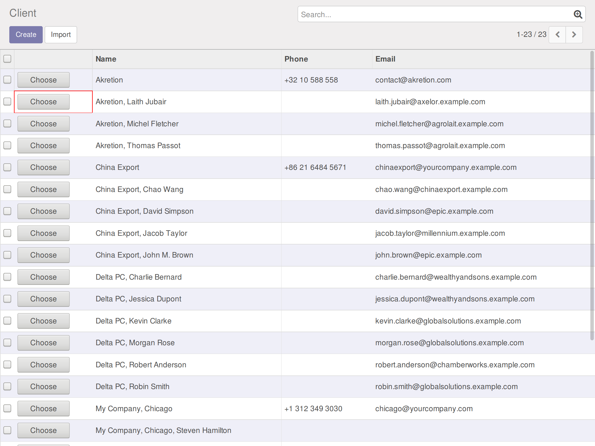

.. image:: https://img.shields.io/badge/license-AGPL--3-blue.png
   :target: https://www.gnu.org/licenses/agpl
   :alt: License: AGPL-3

===================
POS Backend Partner
===================

Choose a POS customer from the backend.

- Replace customer selection screen in POS by a backend view.
- Perf improvement : Full customer list is not downloaded anymore by the POS at startup.
- Benefit from the backend features: advanced search, easy to extend views, etc.

Warning about offline mode
--------------------------

Due to design of this module, you can't choose a **named customer** while offline but you
can still register orders with **anonymous** user.

Configuration
=============

On each client's browser, during the first run, the permission for opening popup is prompted, it should be allowed.

Known issues / Roadmap
======================

* See module pos_backend_communication (OCA/POS)
* css glitch: previously clicked buttons are not reset to initial value

Bug Tracker
===========

Bugs are tracked on `GitHub Issues
<https://github.com/OCA/pos/issues>`_. In case of trouble, please
check there if your issue has already been reported. If you spotted it first,
help us smash it by providing detailed and welcomed feedback.

Credits
=======

Images
------

* Odoo Community Association: `Icon <https://odoo-community.org/logo.png>`_.

Contributors
------------

* Raphaël Reverdy <raphael.reverdy@akretion.com> http://akretion.com

Do not contact contributors directly about support or help with technical issues.

Funders
-------

The development of this module has been financially supported by:

* Akretion

Maintainer
----------

.. image:: https://odoo-community.org/logo.png
   :alt: Odoo Community Association
   :target: https://odoo-community.org

This module is maintained by the OCA.

OCA, or the Odoo Community Association, is a nonprofit organization whose
mission is to support the collaborative development of Odoo features and
promote its widespread use.

To contribute to this module, please visit https://odoo-community.org.

