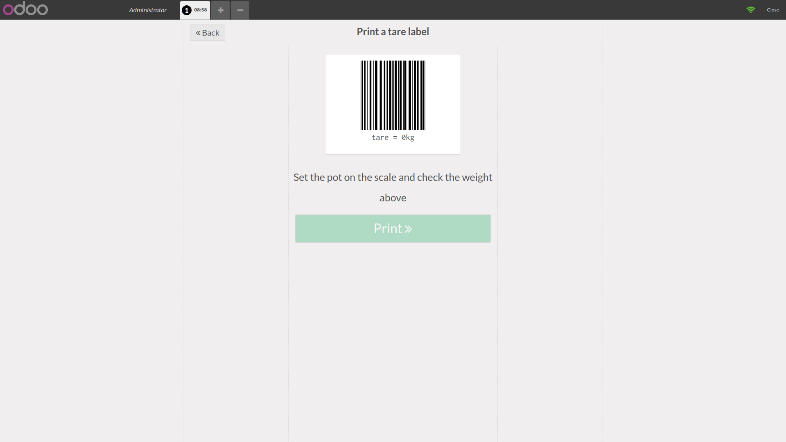
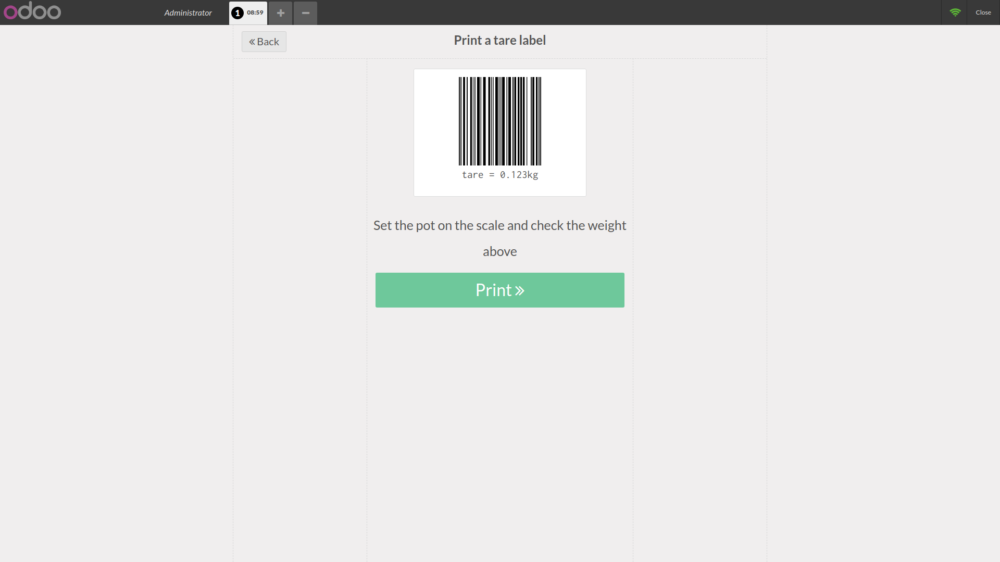
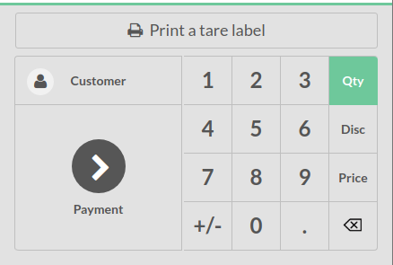

This add-on enables POS to read and print tare barcodes. We print a barcode tare label to sell loose goods in a Bring Your Own pot (BYOC) scheme.

The BYOC scheme has five steps:
    1. The cashier weighs the pot and sticks the tare barcode onto the customer's pot.
    2. The customer go and put loose goods into the labeled pot.
    3. The cashier weighs the pot with loose goods inside. POS computes the price including the pot.
    4. The cashier scans the tare barcode. POS get the pot weight from the barcode. POS subtracts the pot weight from the weight of the latest product. POS sets the billable price for the loose goods.
    5. The customer pays.

This add-on adds a news screen to POS to print (web) the tare barcode labels. This add-on enables POS to read a tare barcode. Reading a barcode makes POS adjust the weight of the latest article in the order list. The new weight is equal to the total weight minus the tare weight. The price is updated accordingly to the weight change.

POS home screen is now:

.. image:: ../static/description/POS_with_button.png

The label screen is:

When we read a weight the impression button is enabled

A barcode label looks like:

.. image:: ../static/description/label.png

Zoom on the action widget:

