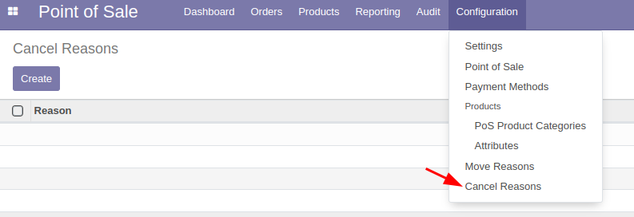
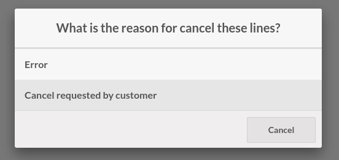

This module extends the functionality of Point of Sale (point_of_sale), and makes it possible to create cancel reasons for order lines. Also implements a setting to cancel order lines immediately, instead of first setting the quantity to 0.

