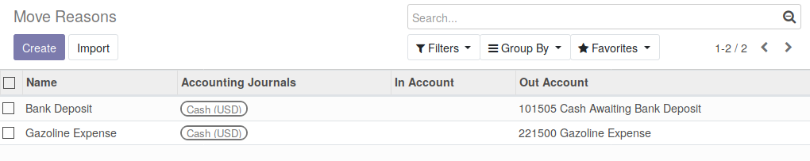
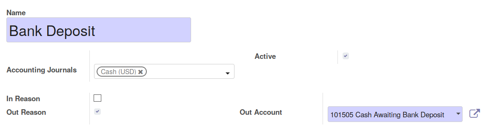

* Go to 'Point of Sale' / 'Configuration' / 'Move Reason'

* Create or update your PoS move Reasons.
* for each reason, you can mention the concerned journal(s), (Generally the
  Cash Journal), and if it is a reason to 'put in' and / or to 'take out'
  Money.

**Note**

You should have checked first 'Used in Point of Sale' for the Journals you want
to enable the feature.
