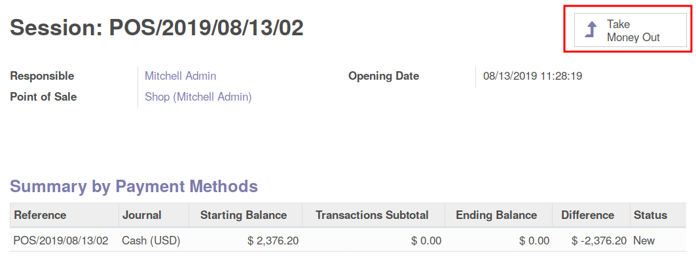
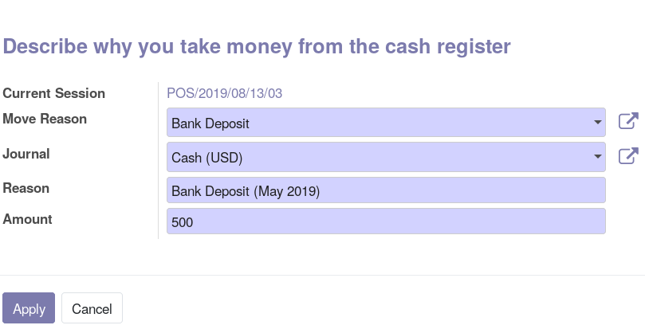
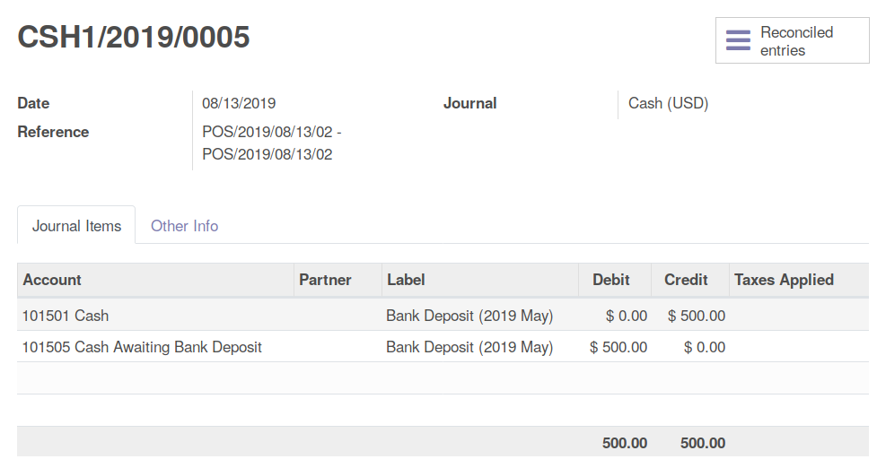

* Go to your current session

* Click on the button "Put Money In" or "Take Money Out"

* Select the reason, the journal, the amount, and optionaly an extra
  description

* When closing the session, an account move will be created, with two lines,
  one with the default journal account, and one with the expense / income
  reason account.

