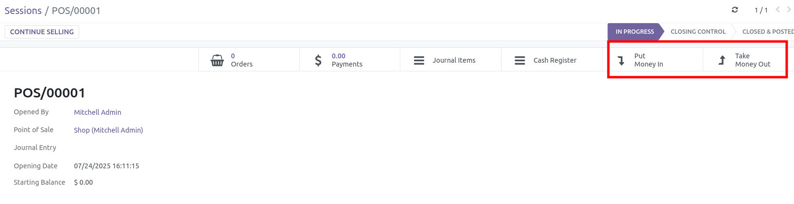
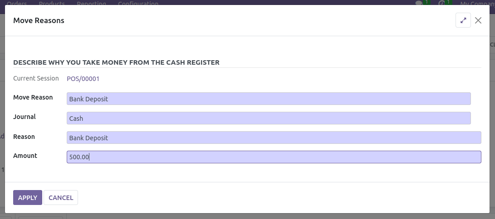
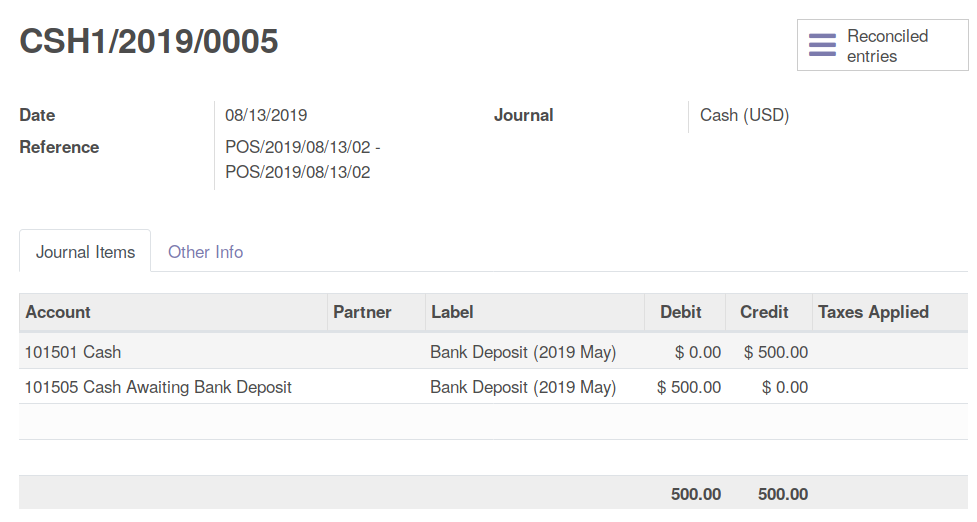
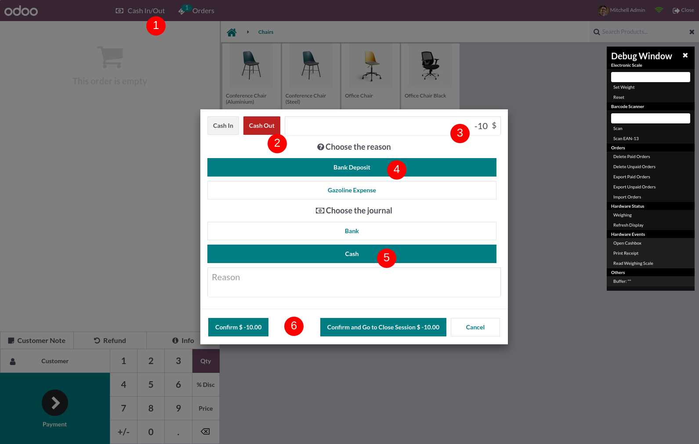
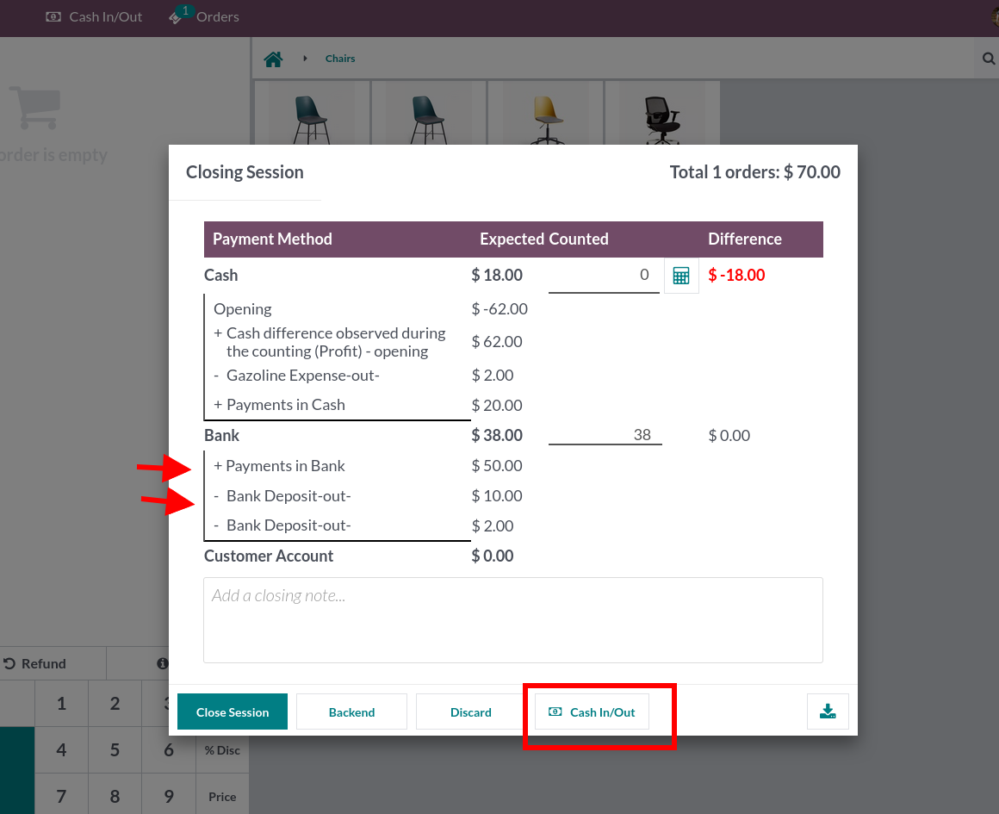

**In backoffice**

* Go to your current session

* Click on the button "Put Money In" or "Take Money Out"

* Select the reason, the journal, the amount, and optionaly an extra
  description

* An account move will be created, with two lines,
  one with the default journal account, and one with the expense / income
  reason account.

**In POS UI**

* Click on Cash In / Out

* Choose Cash In or Cash Out then write the amount

* Choose a Reason

* If it has a Journal, choose Journal

* Confirm and continue sale OR confirm and go to Close PopUp

**In POS UI, from Close PopUp**

* New button "Cash In / Out" can trigger same workflow

* You now can see Positive and Negative Move for every Payment method

