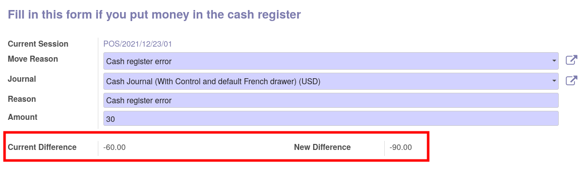

This module is a glue module between ``pos_cash_move_reason``
and ``pos_multiple_control``.

It simply adds in the wizard to take (or put) money the current
control difference field and the new control difference if the cashier confirm
the move.

