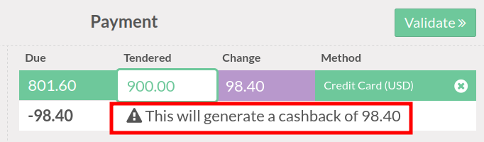

This modules extends the Point of sale functionnalies to add a warning
if confirming an order generate a cashback.

By default, if the payment lines of an Odoo PoS order generate Change,
the journal for the change will be the Cash journal.
That is ok if the original payment line is a Cash payment, but if it's
a payment by credit card, check, meal voucher, etc. confirming the
transaction will generate a cashback.

This module simply add a message in such case.

**Note** : The cashback is an operation that consists,
for a merchant to collect more money in check, credit card, etc.
than the amount of the sale and give change in cash.