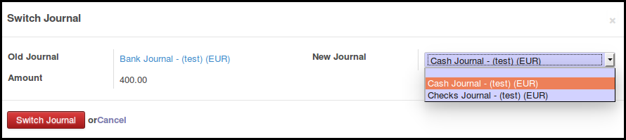
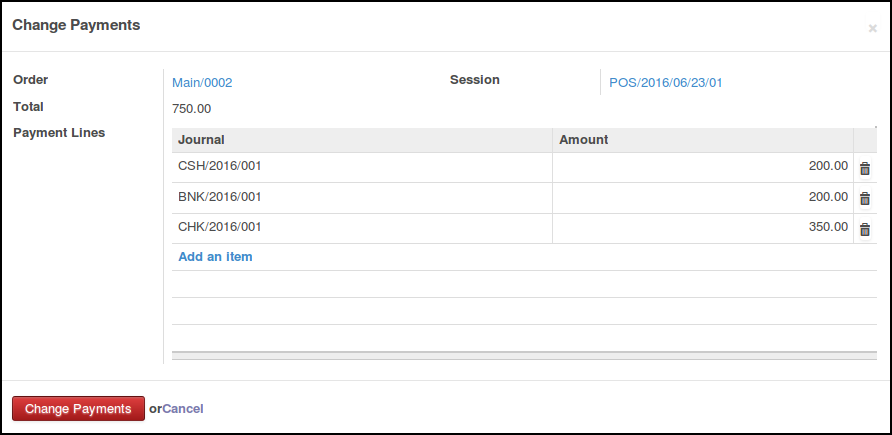

Improve payment changes when user did a mistake and disable some actions on
Point of Sale Bank Statement Line

* Add the possibility to switch a payment (account.bank.statement.line)
  of an order from a journal to another. This feature is usefull when
  the user realized that he did a mistake, during the close of the session,
  or just after he marked the order as paid
  (Only if entries has not been generated)

* Add the possibility to change all payments (method and amount) of a POS
  (Only if entries has not been generated)

Bug Fixes / Improvement
~~~~~~~~~~~~~~~~~~~~~~~

* In the pos.payment wizard, display only the payment methods defined in
  the current POS session

* Disable the possibility to edit / delete a bank statement line on a POS
  Order that has generated his entries, except using the wizard of this
  module. This will prevent the generation of bad account move during
  the close of the session; (mainly unbalanced moves)

* All the cash payment are merged into a single one statement line. This
  feature is usefull if the user use OpenERP as a calculator, writing
  for a payment:

1. Payment 1/ Cash 50 €;
2. Payment 2/ Cash -3,56 €;
3. With this module, the final statement line is a single line Payment 1/ Cash 46,44 €
