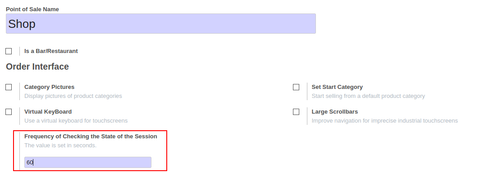
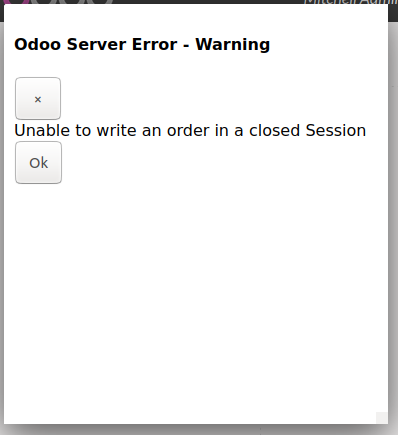

* Go to Point of Sale / Configuration / Point of Sales
* Open a PoS Config and set a frequency for the check

* Alternatively, if you let the value to 0, a lazy check will be
  done when trying to save the order.
  This setting can be interesting, if you have a poor connexion,
  because the check done regularly could generate a bad UX experience
  in that case.

