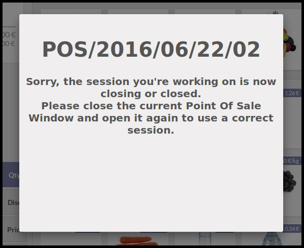

**Context**

In Point Of Sale module, the front-end works offline, so all datas are
loaded at the beginning.
At the end of the session, if user do not close the window, it will be
possible to create new pos order on a closed session, generating errors.

**Functionality**

* This module prevent the possility to create a pos order via the front
  end PoS UI, when session is closed.
* The session state is checked every minute by default. If the state of the
  session is not opened, a blocking pop up is displayed, and user has to
  reload the current page.

