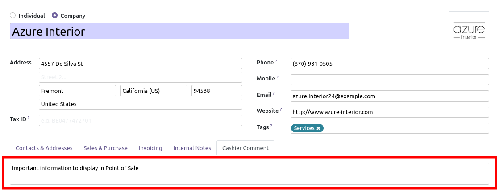
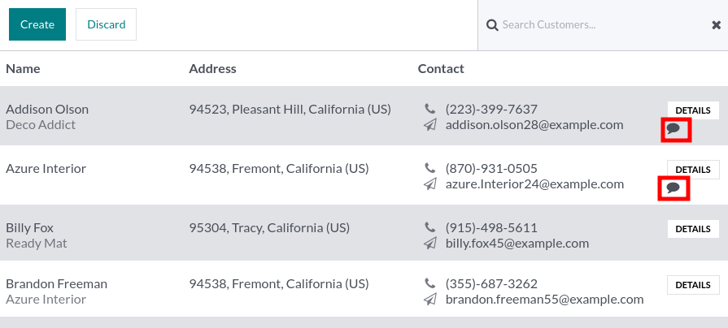
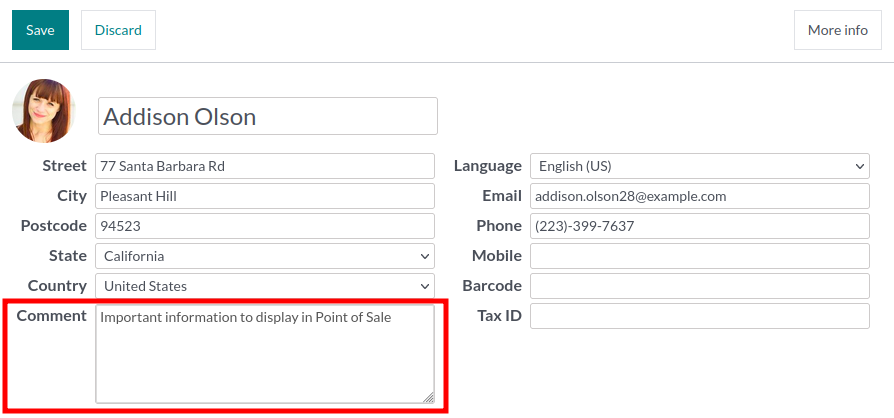

- Go to your partner view and write or edit new PoS comments

- Then Open your Point of sale

in the customer tree view, a new icon is available to mention that the
customer has a PoS Comment to read:

It is possible to see or edit the comment in the customer form view:

