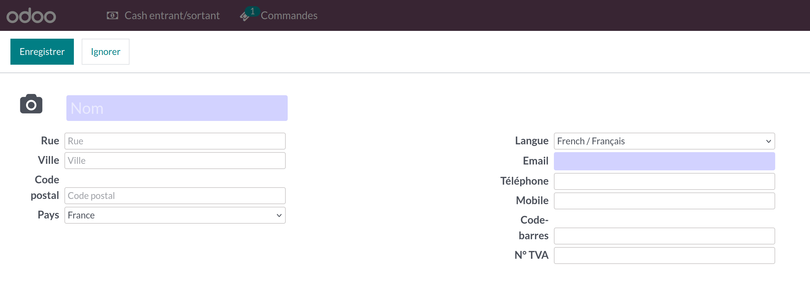

To create or edit partner from PoS

#. Open PoS session
#. Click on client button
#. required filed are highlight (in green)

If you choose an existing partner with missing informations
while validating the payment you will be ask to collect missing
customer informations.

