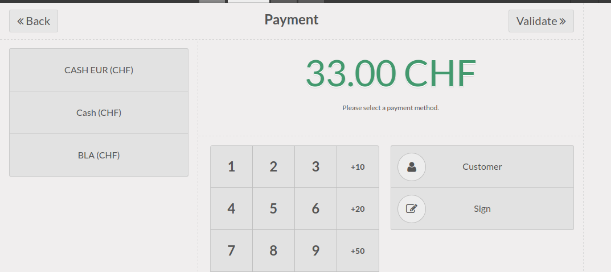
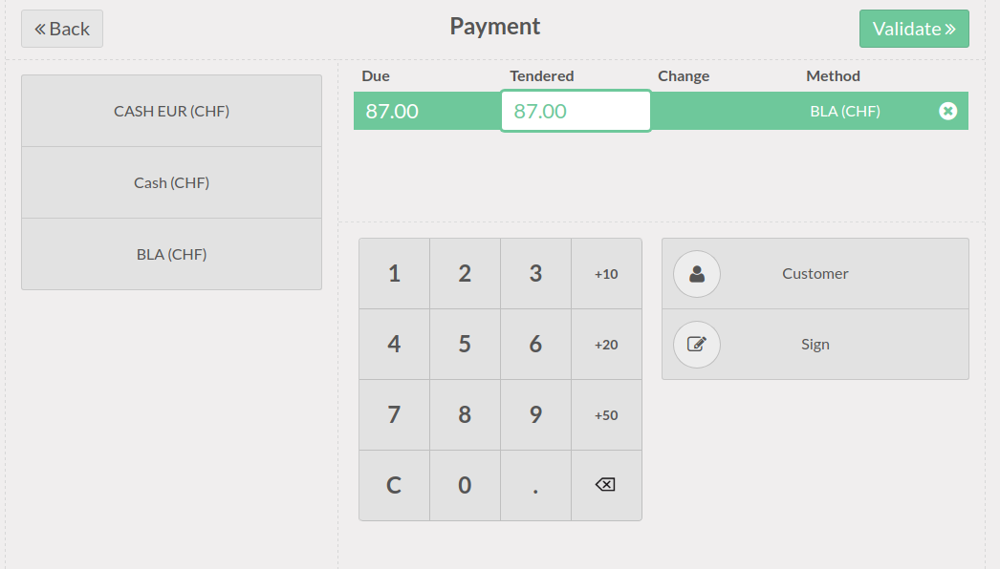

.. image:: https://img.shields.io/badge/licence-AGPL--3-blue.svg
    :alt: License

POS Default payment method
==========================

Configure default payment method for each POS config.

If you set a default one, when you get to the payment view, it will be automatically activated.
If none is set the standard behavior is in place and you have to select the payment method manually.

Use case
--------

The use case is pretty simple:

* you have several payment methods
* most of the time, depending on the POS station, you pay with the same method
* without this module you have to click on the payment method to enable it

So, you want to speed up payment process
when you already know how you want to pay
but still allow to change the method on demand.

This is what you get with standard behavior when you land on the payment page:

and this is what happens when you set a default payment on your config:

The payment method is already activated and you have less work to do.

Bug Tracker
===========

Bugs are tracked on `GitHub Issues <https://github.com/OCA/pos/issues>`_.
In case of trouble, please check there if your issue has already been reported.
If you spotted it first, help us smashing it by providing a detailed and welcomed feedback
`here <https://github.com/OCA/pos/issues/new?body=module:%20pos_default_payment_method%0Aversion:%2010.0%0A%0A**Steps%20to%20reproduce**%0A-%20...%0A%0A**Current%20behavior**%0A%0A**Expected%20behavior**>`_.

Credits
=======

Contributors
------------

* Simone Orsi <simone.orsi@camptocamp.com>

Maintainer
----------

.. image:: http://odoo-community.org/logo.png
   :alt: Odoo Community Association
   :target: http://odoo-community.org

This module is maintained by the OCA.

OCA, or the Odoo Community Association, is a nonprofit organization whose mission is to support the collaborative development of Odoo features and promote its widespread use.

To contribute to this module, please visit http://odoo-community.org.
