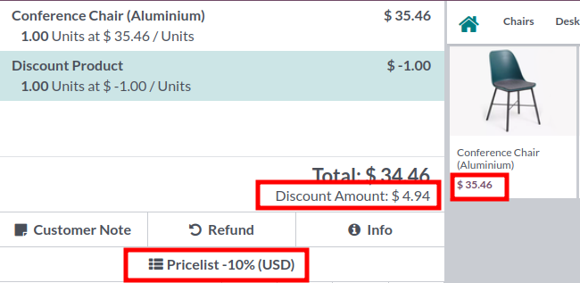
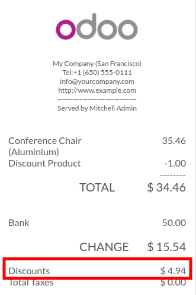

Open your point of Sale

Make an order. for exemple,
- select the product 'Conference chair (39.40$)'
- select the pricelist -10%
- add a discount of 1$

The total discount is 1$ + 10% * 39.40 = 4.94$

Note, the discount displayed on the ticket is updated, to take into account all the discount.

