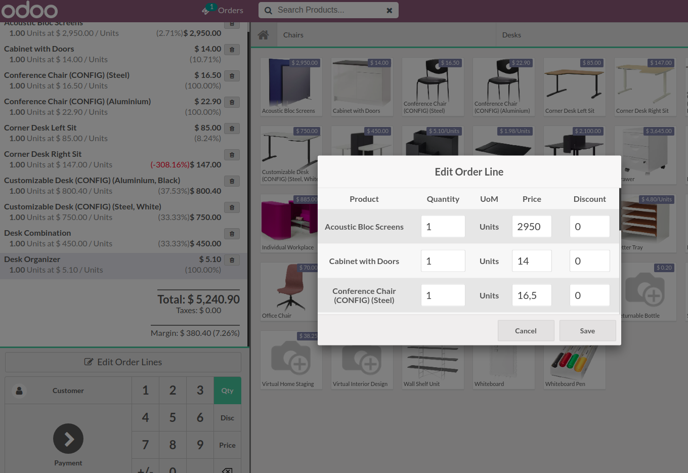

This module adds a button "Edit order lines" in main POS interface to allow an easier UX for cashier when editing product price, qty and discount.

On button click, a popup with order lines allows user to input a clear value for each field, instead of having to use the default process of selecting which field to edit, which is not very intuitive and error-prone.

