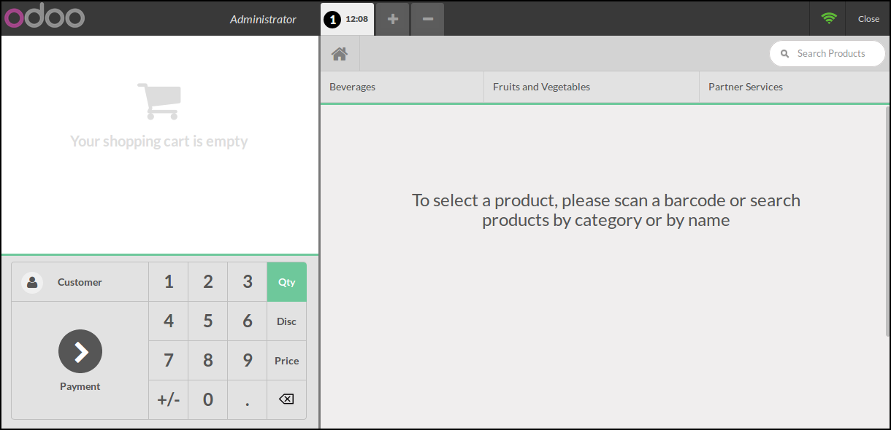

This module extends Odoo Point Of Sale features, displaying an empty home page
at the start of the Point of Sale, or when no search is done and no category
is selected. (when root category is selected)

This module is interesting to avoid to display useless products, when user did
not yet realized a search. (Default displayed products are just the first
eighty products)

It can limits errors to avoid users to select undesired product.

