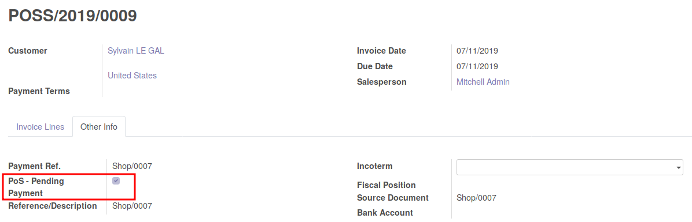

This module extend the Point of Sale Odoo module, regarding invoicing.

This module prevent to make some mistakes in Odoo Point of Sale
regarding invoices generated via Point of Sale.

Without this module
~~~~~~~~~~~~~~~~~~~

When an invoice generated from Point of Sale is confirmed
it is in a 'open' state, until the session is closed, and the entries are
generated. At this step, invoice will be marked as 'paid' and the related
accounting moves will be reconcilied.
So, as long as the session is not closed, any user can:

* cancel the invoice;
* register a payment;
* reconcile the invoice with an existing payment;

All that action should be prohibited because the payment exists.

With that module
~~~~~~~~~~~~~~~~

All those actions will not be possible anymore.

Note that the changes only impact the opened invoice coming from point of sale,
before the session is closed.

Technically
-----------

* add a ``pos_pending_payment`` field on the ``account.invoice`` to mark the
  items that shouldn't be paid.

This field is checked when the invoice is created from point of sale,
and is unchecked, when the session is closed.

