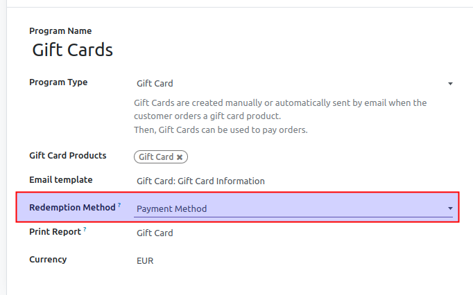
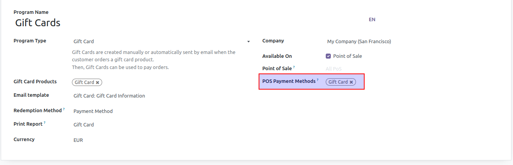
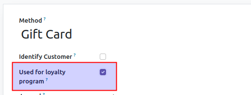

To allow a loyalty program of type *Gift Card* to be redeemed as a payment
method, first select *Payment Method* as *Redemption Method*:

Then, choose those *POS Payment Methods* that will be used to redeem cards:

On selected payment methods, field *Used for loyalty program* has to be checked:

