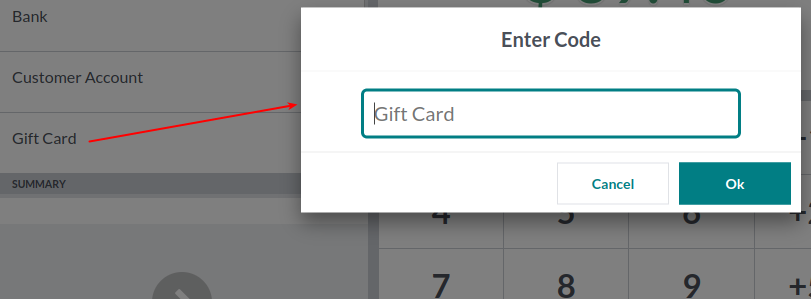
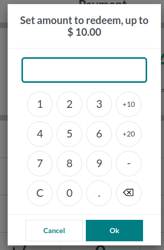
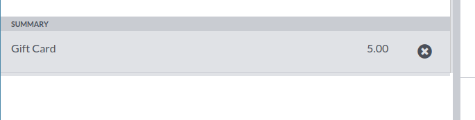

In the payment screen of PoS interface, after selecting configured payment
method a popup requests loyalty card code:

After entering card code, a new popup asks user to introduce amount to redeem:

A new payment line is added with selected amount:

After order is completed, loyalty card report is downloaded with updated
points.
