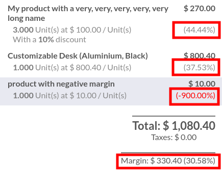
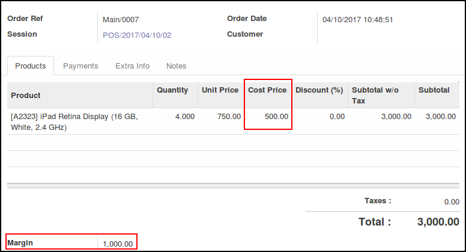

**In the PoS Front Office**

* Make an order. Each time a line is added, updated, or deleted, the margin and the margin rate
  will be updated.

**In the PoS Back Office**

To use this module, you need to:

* Go to 'Point Of Sale' / 'Orders' / 'Orders'
* Open an order

