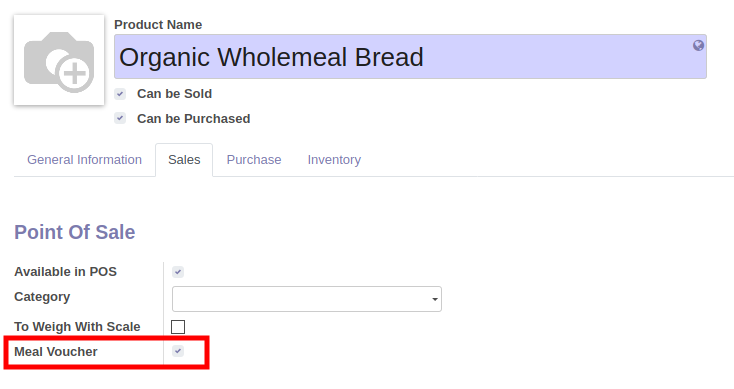
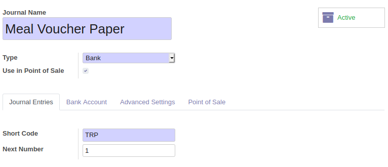
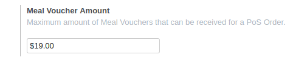

Products
~~~~~~~~

* go to your products, and click on the 'Meal Voucher' checkbox, if your product
  can be paid with meal vouchers.

* You can configure your product categories to have a default value for the products
  that belong to this category.

.. figure:: ../static/description/product_category_form.png

* configures your Account journals, mentioning the type of Meal Voucher:

- Paper : the journal will be used when scanning meal voucher barcodes
- Dematerialized: the journal will be used for dematerialized meal vouchers
- Mixed: Specific configuration if your accountant want to use a single journal for Credit card AND dematerialized meal vouchers. In that case, the button of this journal will be duplicated, and an extra text can be set to display an alternative label.

* go your point of sale configuration form, and set the maximum amount allowed by ticket. (optional)

