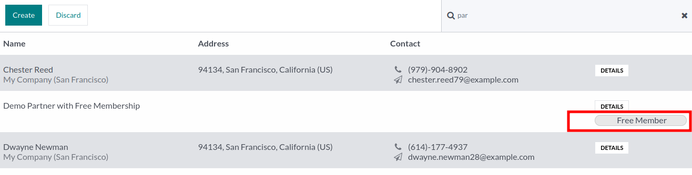
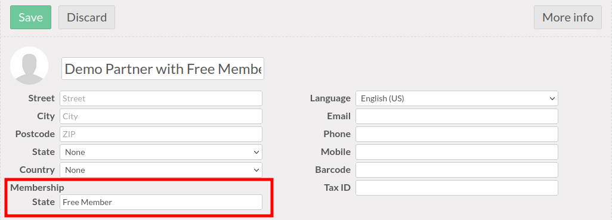

This module extends the functionality of point of sale module, to
add informations related to Odoo ``membership`` module.

For instance :

- It displays the field 'Current Membership Status' of the partners in the
  point of sale screen. (partner list and partner form view)

**Partner List View**

**Partner Form View**

- it raises an error, if cashier try to sell a membership product,
  without having selected the 'Invoice' option.

