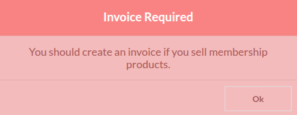

This module extends the functionality of point of sale module, to
add informations related to Odoo ``membership`` module.

For instance :

- It displays the field 'Current Membership Status' of the partners in the
  point of sale screen. (partner list, partner form view and product screen)

  The field is displayed in green if it matches "Invoiced Member",
  "Free Member" or "Paid Member" and in red if it matches "Cancelled Member",
  "Old Member" or "Waiting Member".

  **Partner List View**

  .. figure:: ../static/description/pos_ui_partner_tree.png

  **Partner Form View**

  .. figure:: ../static/description/pos_ui_partner_form.png

  **Product Screen**

  .. figure:: ../static/description/pos_ui_product_screen.png

- it raises an error, if cashier try to sell a membership product,
  without having selected the 'Invoice' option.

