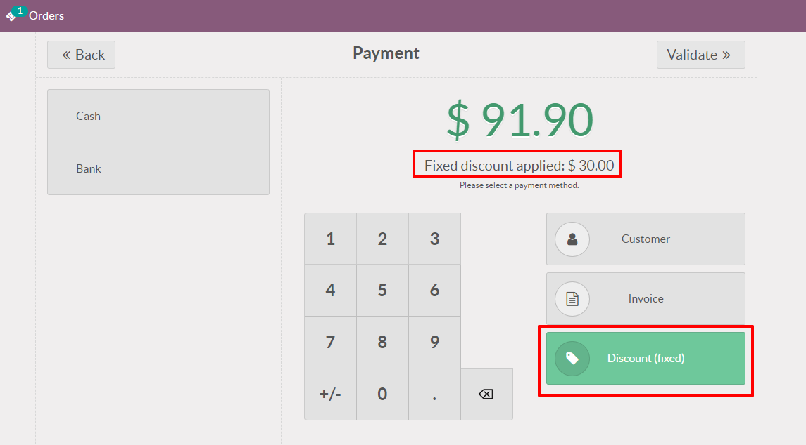
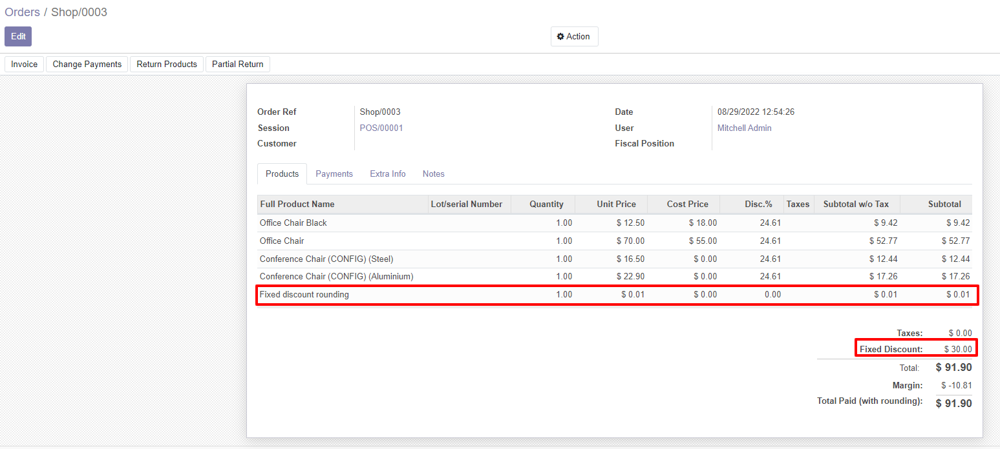

- Fixed discount is applied on payment screen of POS interface, in order to make sure the discount is applied to all products in the order.

- Once validated, in POS > Orders you can check the fixed discount applied to the order, the discount % on each line, and the necessary rounding amount.

