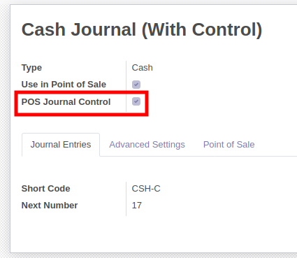
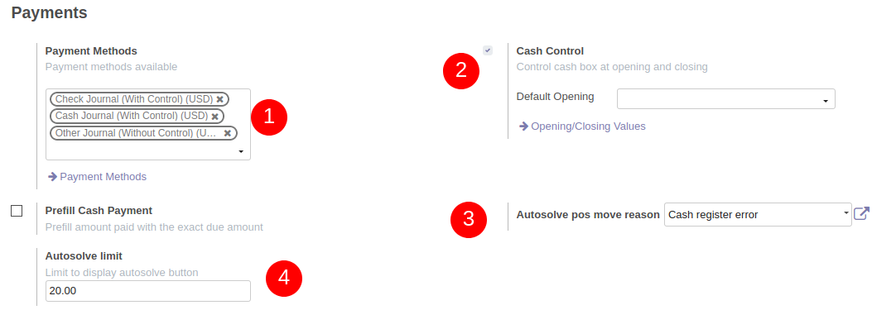

To configure this module, you need to:

**Configure the journals** you want to control in your point of sale (POS)

* Go to Invoicing / Configuration / Journals / Journals

* Check the box 'POS Journal Control' if you want to enable this feature for this journal

* Unchecked journal will be in grey

**Configure your POS configuration** 

* Go to Point of Sale / Configuration / Point of Sale / <your pos> 

* Choose your Payments methods (1)

* Check Cash Control (2)

* (optional) Choose a "pos move reason" to ausolve difference (3) (see pos_move_reason module for more details) 

* (optional) Choose a limit to allow or not the user to autosolve control difference in pos - Set 0 if you don't want any limit. (4)

