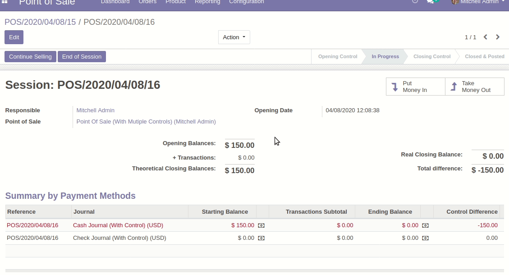
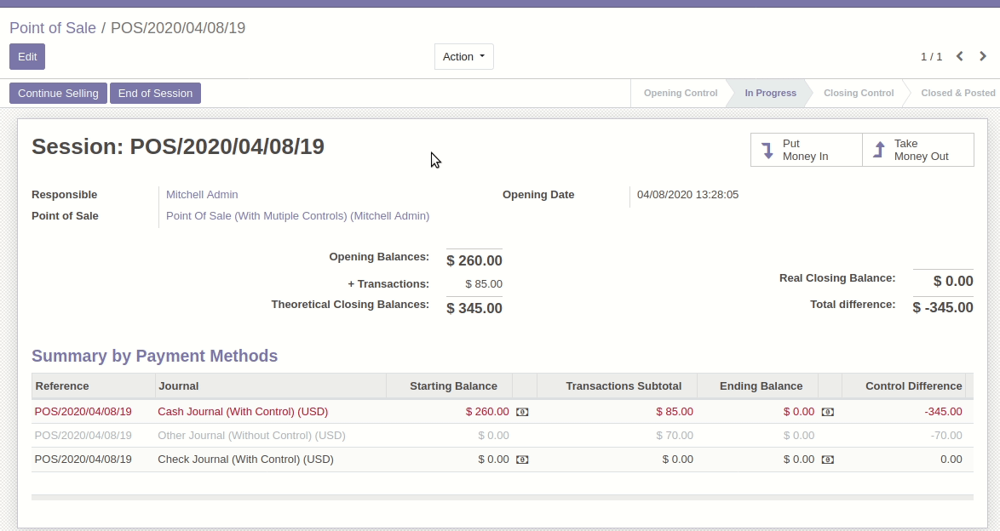

This module extends the functionality of the point of sale by allowing a 
better control at the closing of the session.

* Show differences for all statements chosen (see config part)

* Allow user to control each statement. (not only the cash statement, by
  default) and change his starting and ending balance

The cashbox lines are recorded and can be found later.

* Quickly solve differences (we can set an absolute limit),
  thanks to pos_move_reason

See this gif where where we set ending balance with difference, solve it and
close session :

As the verification is more complete, allow the user to reopen a new session, 
if the first one is in a closed state.

Extra checks are done, to prevent user errors:

* It is not possible to click on the button 'Close Session' if there are some
  draft orders.
