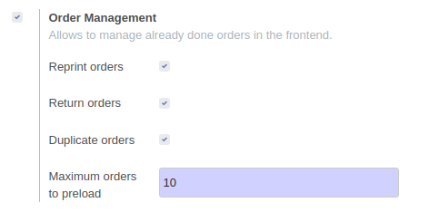

To configure this module, you need to go to *Point of Sale > Configuration >
Point of Sale* and enable *Order Management*

#. Enable *Return orders* on if you want to be able to return past orders
   in that PoS.

#. Enable *Duplicate orders* on if you want to be able to return past orders
   in that PoS.
