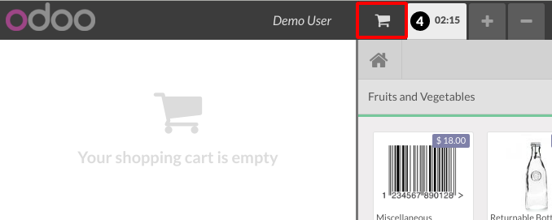
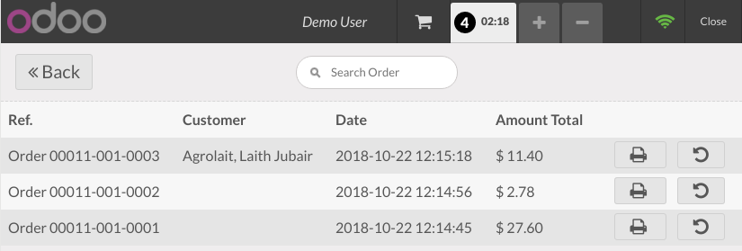

Once the PoS is loaded, you'll find a shopping trolley icon (🛒) in the top
bar that grants access to the order list screen.

There you can find the number of past orders loaded according to your
configuration (see Configuration) as well as the orders you checked out in
the current session:

#. You can see their totals as well as their custumers if registered.
#. You can reprint their tickets clicking on the printer icon (⎙).
#. You can return them pressing on the arrow icon (↶).
#. You have a search input as well that lets you find past tickets by its
   reference number.

NOTE: You'll need your PoS to be online to be able to search or return a past
ticket.
