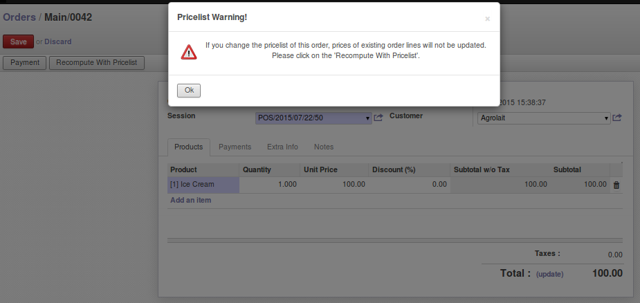

.. image:: https://img.shields.io/badge/licence-AGPL--3-blue.svg
   :target: http://www.gnu.org/licenses/agpl-3.0-standalone.html
   :alt: License: AGPL-3

======================================================
Improve pricelist changes for POS Order in back office
======================================================

* On a POS order, when changing a pricelist, warn the user as in sale
  module, when doing a quotation;
* On a POS order, provide a 'Recompute With pricelist' button to update
  when pricelist has changed;

Installation
============

Regular installation.

Configuration
=============

No configuration needed.

Usage
=====

.. image:: https://odoo-community.org/website/image/ir.attachment/5784_f2813bd/datas
   :alt: Try me on Runbot
   :target: https://runbot.odoo-community.org/runbot/184/8.0
   
Credits
=======

Contributors
------------

* Sylvain LE GAL (https://twitter.com/legalsylvain);

Maintainer
----------

.. image:: https://odoo-community.org/logo.png
   :alt: Odoo Community Association
   :target: https://odoo-community.org

This module is maintained by the OCA.

OCA, or the Odoo Community Association, is a nonprofit organization whose mission is to support the collaborative development of Odoo features and promote its widespread use.

To contribute to this module, please visit https://odoo-community.org.
