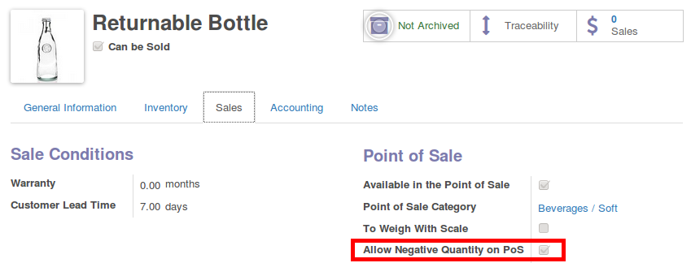

In some cases, you may want to block the possibility to allow negative quantity
in a PoS Order, without mentioning initial order. This can happen for special
products like returnable products, etc.

In that case, a checkbox is possible on Product Form View to allow such case

