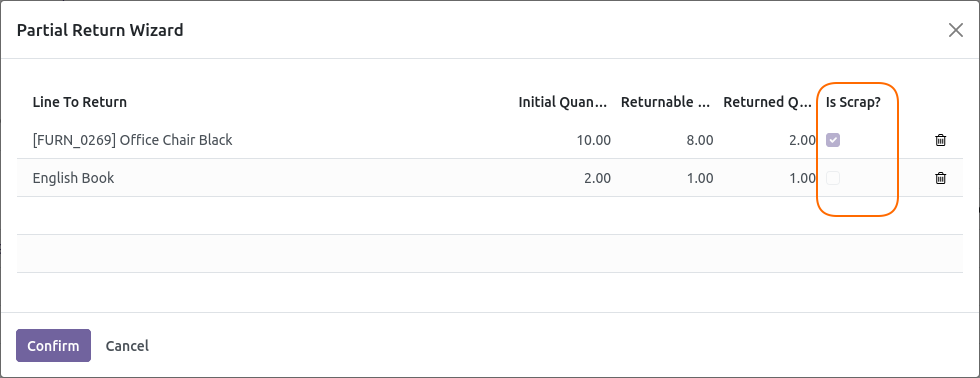

- Go to Point of Sale and locate an existing POS Order
- Click "Partial Return"
- A popup will open

- For any product being returned as damaged or unusable:
  - Enable the checkbox "Is Scrap?"
- Confirm the return

Once validated:
- Standard return processing occurs
- A Scrap Order is automatically created for each scrap-marked product line
