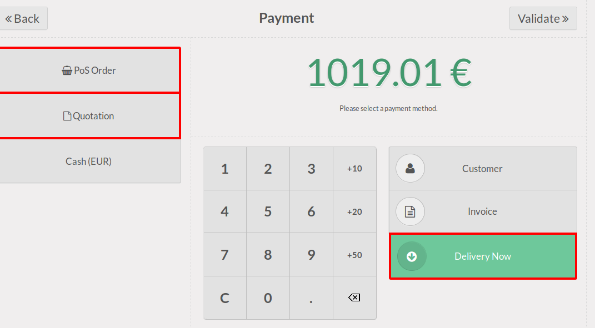

.. image:: https://img.shields.io/badge/licence-AGPL--3-blue.svg
   :target: http://www.gnu.org/licenses/agpl-3.0-standalone.html
   :alt: License: AGPL-3

=======================
POS Order To Sale Order
=======================

This module extends the functionality of point of sale to allow sale orders
creation from the Point of Sale.

In the POS UI, buttons has been added to create a sale order and discard
the current POS order.

This module is useful in many cases, for example :

* take quotations with a very simple interface
* take orders with a very simple interface
* allow clients to pay later
* if you have some customers that come every day in your shop, but want to
  have a unique invoice at the end of the month. With this module, you can
  create a sale order and deliver products every time he comes 
  to keep your stock value correct and to create a unique invoice periodically.

Four options are available:

#. '**Allow PoS order**'

   A PoS Order is the default type of order (opposed to sale orders).
   If you want to use only sales order, uncheck this option.

#. '**Allow Quotations**'

   A quotation is a draft sale order. 
   It can be changed and confirmed later from the backend.
   No payment can be taken with draft orders.

#. '**Allow Sale Orders**'

   A confirmed sale order without picking.
   Useful if you don't manage stock or sell services otherwise
   use 'delivered picking'.

#. '**Allow Delivered Sale Orders**'

   A sale order will be created and confirmed. The associated picking
   will be marked as delivered.
   Use this option if you delivery your customer frequently and bill him periodically

If multiple options are activated, buttons will appear on the payment screen.

Configuration
=============

To configure this module, you need to:

#. Go to Point Of Sale / Configuration / Point of Sale
#. Select the desired behavior by setting some of the checkboxes: 

  - Allow PoS order, 
  - Allow Quotations, 
  - Allow Sale Orders,
  - Allow Delivered Sale Orders

Usage
=====

In the PoS, on the payment screen, new buttons will appear according
 to options set in the configuration.

.. image:: https://odoo-community.org/website/image/ir.attachment/5784_f2813bd/datas
   :alt: Try me on Runbot
   :target: https://runbot.odoo-community.org/runbot/184/8.0

Technical Notes
===============

* Some hooks are defined in the JS file, to define custom behavior after
  having created the sale order (and the stock picking).

* Some prepare functions are available in the sale.order model, to overload
  the creation of the sale order.

* An additional, not displayed option, is to allow payment for sale orders.
  It requires an additinnal module (not yet written) to handle it correctly.

Known issues / Roadmap
======================

* Demo not ported yet. It was non functionnal before migration.
* Because of the poor design of the Odoo Point of Sale, some basic features
  are not available by default, like pricelist, fiscal position, etc ...
  For that reason, unit price will be recomputed by default, when creating the
  sale order, and the unit price of the current bill will not be used.
  We could imagine to create an option 'Use Pos Order Unit Price' in a setting.

For more information about that point, you could check pos_pricelist OCA
module. (same repository).

Bug Tracker
===========

Bugs are tracked on `GitHub Issues
<https://github.com/OCA/pos/issues>`_. In case of trouble, please
check there if your issue has already been reported. If you spotted it first,
help us smash it by providing detailed and welcomed feedback.

Credits
=======

Contributors
------------

* Sylvain Le Gal (https://twitter.com/legalsylvain)
* Raphaël Reverdy (https://github.com/hparfr)

Funders
-------

The development of this module has been financially supported by:

* GRAP, Groupement Régional Alimentaire de Proximité (http://www.grap.coop)
* Akretion

Maintainer
----------

.. image:: https://odoo-community.org/logo.png
   :alt: Odoo Community Association
   :target: https://odoo-community.org

This module is maintained by the OCA.

OCA, or the Odoo Community Association, is a nonprofit organization whose
mission is to support the collaborative development of Odoo features and
promote its widespread use.

To contribute to this module, please visit https://odoo-community.org.
