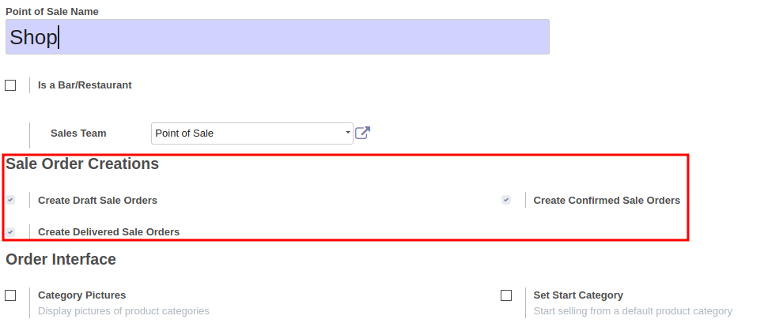
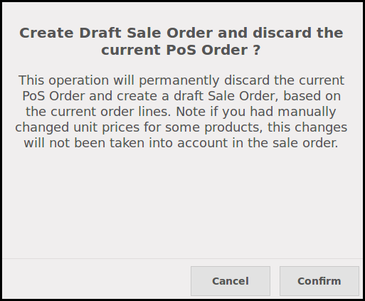

.. image:: https://img.shields.io/badge/licence-AGPL--3-blue.svg
   :target: http://www.gnu.org/licenses/agpl-3.0-standalone.html
   :alt: License: AGPL-3

=======================
POS Order To Sale Order
=======================

This module extends the functionality of point of sale to allow sale orders
creation from the Point of Sale.

In the POS UI, buttons has been added to create a sale order and discard
the current POS order.

This module is usefull in many cases, for exemple :

* take orders with a very simple interface

* if you have some customers that come every day in your shop, but want to
  have a unique invoice at the end of the month. With that module, you can
  create a sale order and deliver products every time to keep your stock value
  correct, and to create a unique invoice, when you want.

Three options are available:

#. '**Create a draft Order**'
  A new sale order in a draft mode will be created that can be changed later.

.. figure:: static/description/pos_create_picking_option_1.png
   :width: 800 px

#. '**Create a Confirmed Order**'
  A new sale order will be created and confirmed.

.. figure:: static/description/pos_create_picking_option_2.png
   :width: 800 px

#. '**Create Delivered Picking**' (by default)
  A new sale order will be created and confirmed. the associated picking
  will be marked as delivered.

.. figure:: static/description/pos_create_picking_option_3.png
   :width: 800 px

Configuration
=============

To configure this module, you need to:

#. Go to Point Of Sale / Configuration / Point of Sale
#. Check the box 'Create Sale Orders'
#. Select the desired default behaviour

Usage
=====

.. image:: https://odoo-community.org/website/image/ir.attachment/5784_f2813bd/datas
   :alt: Try me on Runbot
   :target: https://runbot.odoo-community.org/runbot/184/8.0

Technical Notes
===============

* Some hooks are defined in the JS file, to define custom behaviour after
  having created the sale order (and the stock picking).

* Some prepare functions are available in the sale.order model, to overload
  the creation of the sale order.

* You could be interested by another module, pos_sale_order, that completely
  alter Point of Sale module, avoiding creating Pos Orders, and creating
  allways Sale Orders.
  This module is a WIP state, and is available here:
  https://github.com/OCA/pos/pull/35

Known issues / Roadmap
======================

* Because of the poor design of the Odoo Point of Sale, some basic features
  are not available by default, like pricelist, fiscal position, etc ...
  For that reason, unit price will be recomputed by default, when creating the
  sale order, and the unit price of the current bill will not be used.

Note that this problem is fixed if ``pos_pricelist`` is installed.
(same repository) In that cases, the pricelist, the unit prices and the taxes
will be the same in the order, as in the displayed bill.

Bug Tracker
===========

Bugs are tracked on `GitHub Issues
<https://github.com/OCA/pos/issues>`_. In case of trouble, please
check there if your issue has already been reported. If you spotted it first,
help us smash it by providing detailed and welcomed feedback.

Credits
=======

Contributors
------------

* Sylvain Le Gal (https://twitter.com/legalsylvain)

Funders
-------

The development of this module has been financially supported by:

* GRAP, Groupement Régional Alimentaire de Proximité (http://www.grap.coop)

Maintainer
----------

.. image:: https://odoo-community.org/logo.png
   :alt: Odoo Community Association
   :target: https://odoo-community.org

This module is maintained by the OCA.

OCA, or the Odoo Community Association, is a nonprofit organization whose
mission is to support the collaborative development of Odoo features and
promote its widespread use.

To contribute to this module, please visit https://odoo-community.org.
