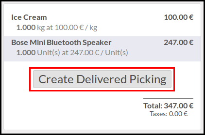

This module extends the functionality of point of sale to allow sale orders
creation from the Point of Sale.

In the POS UI, buttons has been added to create a sale order and discard
the current POS order.

This module is usefull in many cases, for exemple :

* take orders with a very simple interface

* if you have some customers that come every day in your shop, but want to
  have a unique invoice at the end of the month. With that module, you can
  create a sale order and deliver products every time to keep your stock value
  correct, and to create a unique invoice, when you want.

Three options are available:

* **Create a draft Order**
  A new sale order in a draft mode will be created that can be changed later.

.. figure:: ../static/description/pos_create_picking_option_1.png
   :width: 800 px

* **Create a Confirmed Order**
  A new sale order will be created and confirmed.

.. figure:: ../static/description/pos_create_picking_option_2.png
   :width: 800 px

* **Create Delivered Picking** (by default)
  A new sale order will be created and confirmed. the associated picking
  will be marked as delivered.

**Technical Notes**

* Some hooks are defined in the JS file, to define custom behaviour after
  having created the sale order (and the stock picking).

* Some prepare functions are available in the sale.order model, to overload
  the creation of the sale order.

* You could be interested by another module, pos_sale_order, that completely
  alter Point of Sale module, avoiding creating Pos Orders, and creating
  allways Sale Orders.
  This module is a WIP state, and is available here:
  https://github.com/OCA/pos/pull/35
