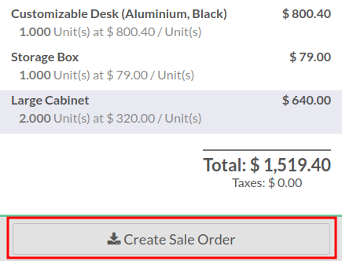
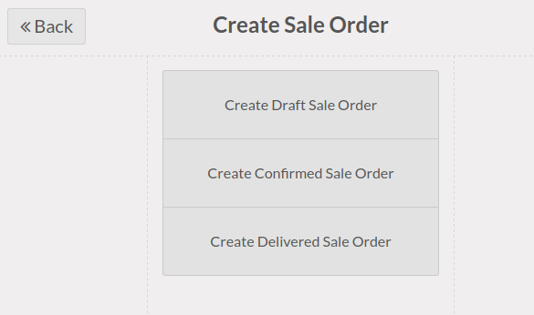

* Open your Point of sale
* create a new order and select products
* select a customer

* then, click on the "Create Sale Order" button

Three options are available:

* **Create a draft Order**
  A new sale order in a draft mode will be created that can be changed later.

* **Create a Confirmed Order**
  A new sale order will be created and confirmed.

* **Create Delivered Picking** (by default)
  A new sale order will be created and confirmed. the associated picking
  will be marked as delivered.

