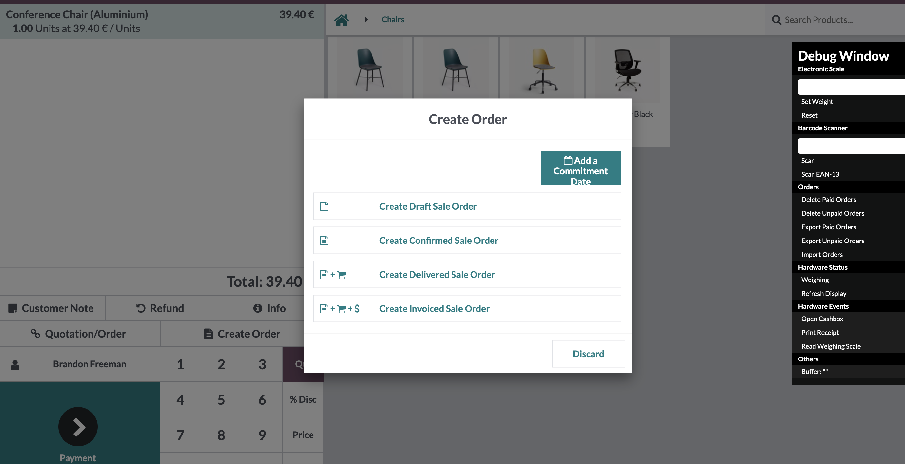
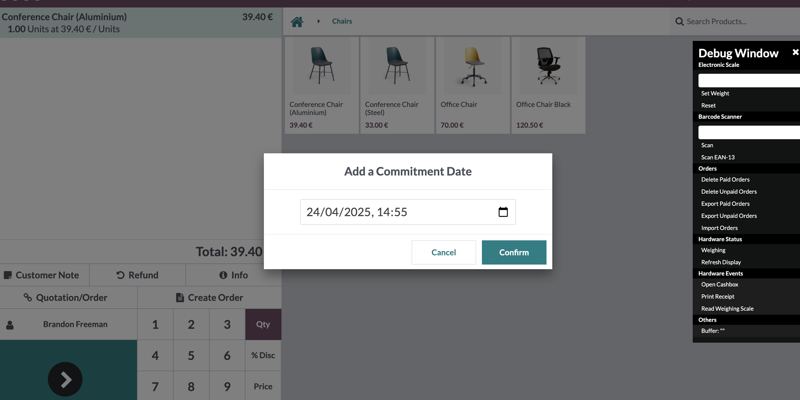

After enabling the option mentioned in the configuration section, go to the Point of Sale.
Once inside, create an order just like with the ``pos_order_to_sale_order`` add-on,
and use the option to create a sale order.

Once the popup appears, there is an option called **"Add Commitment Date"**.
If you select it and click on any of the base options,
a new popup will appear allowing you to add the delivery date.

