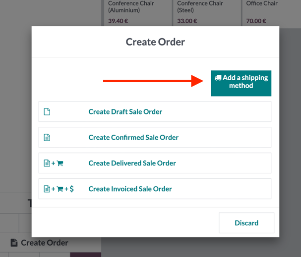
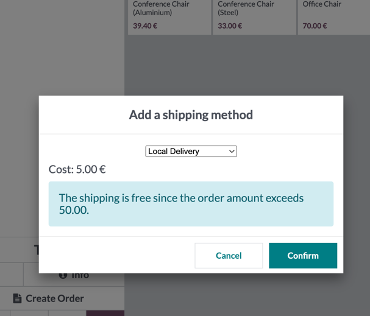

* Open your Point of sale
* Create a new order and select products
* Select a customer
* Click on the "Create Order" button
* Click on the "Add a shipping method" button

* Click Create Sale order button

Before creating a sales order, a popup will open where you can specify the shipping method

* Click on the "Confirm" button to add the selected method during the sales order creation process
