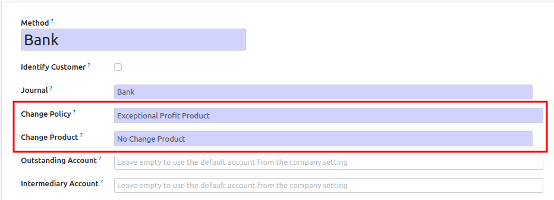

**Exceptional Profit Product**

* Create a dedicated 'No change' Product.
  The type of the product should be 'Service' and the product should available in PoS.
  Generally, no VAT is applied on such product.

* Go to the payment method form.

* set 'Change Option' as 'Exceptional Profit Product'

* set the new product in the 'Change Product field'

