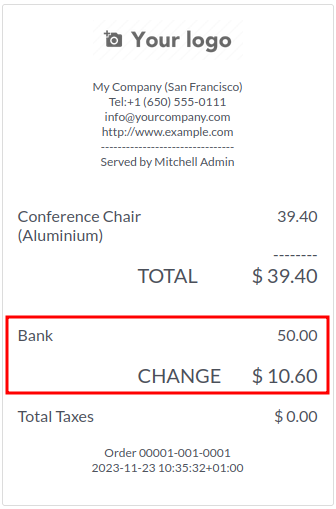
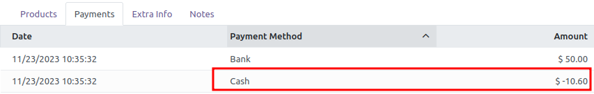

This module improves the 'Change' feature in Odoo Point of Sale,
when a customer pays more that the amount of the PoS Order:

.. figure:: ../static/description/cash_1_payment_screen.png

By default, a "Change" line is added on the receipt:

from an accounting point of view, it adds a second payment line in 'Cash' method
with a negative amount corresponding to the surplus:

In some countries and for some payment methods, this is not the right way to proceed.

This module adds extra "Change Policy" option to manage differently the giving of change.
