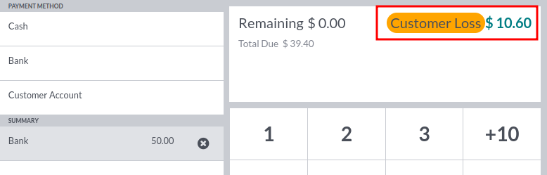
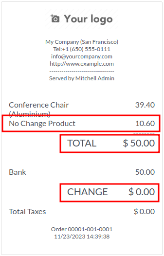
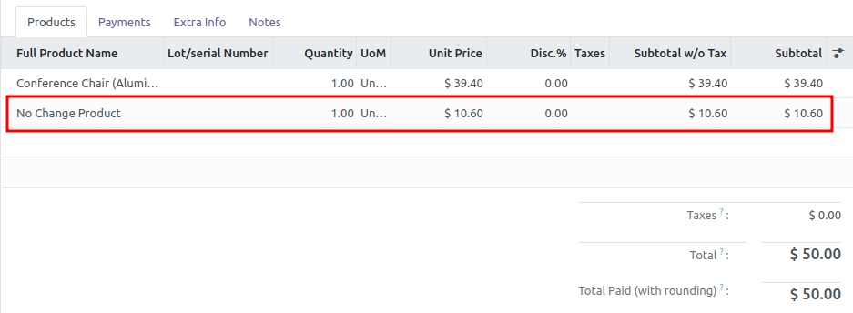

**Exceptional Profit Product**

A dedicated warning will be displayed:

By default, a new sale order line is added on the receipt:

So, from an accounting point of view, it adds a new line that will
impact a profit and loss account:

