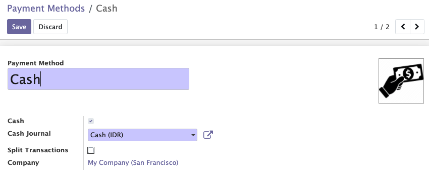

To configure this module, you need to:

* Go to 'Point Of Sale' / 'Configuration' / 'Payment Methods'

* Select a payment method

Note:

If there is no image defined, default image will be set, depending
on the configuration (cash, customer wallet, bank)
