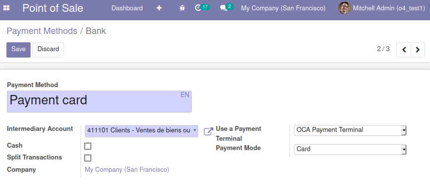

* Go to *Point of Sale > Configuration > Payment Methods*, edit the
  payment method corresponding to the card reader and set
  the field *Use a payment terminal* to *OCA Payment Terminal*. A new field *Payment Mode* will appear, that has *Card* as defaut value. If the payment method is for Checks and you have a check printer, select *Check* instead.

