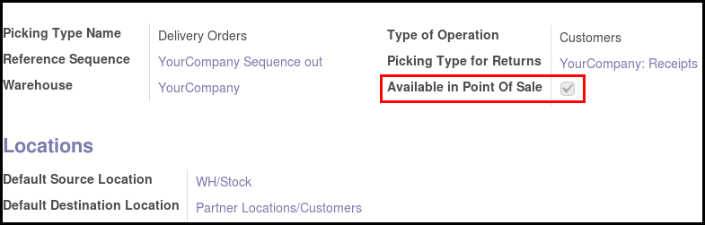

.. image:: https://img.shields.io/badge/licence-AGPL--3-blue.svg
   :target: http://www.gnu.org/licenses/agpl-3.0-standalone.html
   :alt: License: AGPL-3


================
POS Picking Load
================


This module extends the functionality of point of sale to allow you to
load your pickings in the Point of Sale, in order to add / remove products
and so create a PoS Order and mark it as paid.

Detailled Use Case
==================

This module is usefull for the following use case

* You have many Sale Orders that have generated pickings. Typically if you have
  connected your Odoo instance to an online store like Shop Invader,
  Prestashop, Magento, or if you use light Odoo shop (```website_sale```
  module).
* Once the order validated, you prepare your pickings
* The customer come in your shop to recover his order
* the customer add (or remove) some products
* the customer pay his order, based on the real delivered products list.

Configuration
=============

To configure this module, you need to:

#. Go to Warehouse / Configuration / Types of Operation
#. Select the picking type(s) you want to see in the point of sale
#. Check the box 'Available in Point of Sale'



Note: This box is NOT enabled by default except in demo data for the type
'Delivery Orders' of the demo company 'YourCompany'.

#. Go to Point of Sale / Configuration / Point of Sales
#. Select the Point(s) of Sales witch those you want to enable the feature
#. Check the box 'Load Pickings'.


Note: This box is enabled by default

Usage
=====

To use this module, you need to:

* Launch the point of sale
* On a new order (without lines), click on the 'Load Picking' button.

.. figure:: static/description/load_picking_01.png
   :width: 800 px

* Point of sale will load available pickings. (About displayed pickings, see
  'Technical Notes' below).

.. figure:: static/description/load_picking_02.png
   :width: 800 px

* Click on a picking will display the content of the moves (as PoS Order Lines)

.. figure:: static/description/load_picking_03.png
   :width: 800 px

The price and the discount will be the sale price and the discount set in
the according Sale Order Line, if it was found. Otherwise, discount will be to
0, and unit price will be the unit price of the product when it has been
loaded in the Point of Sale.

**Related Sale Order:**

.. figure:: static/description/load_picking_04.png
   :width: 800 px

**Related Picking:**

.. figure:: static/description/load_picking_05.png
   :width: 800 px

* Confirm the selection, by clicking on 'Select' button.

* Finally, you can add / remove products or change quantity and collect the
  payment.

When, the order is marked as paid, the original picking will be cancelled,
because Point Of Sale generates a new picking related to the real delivered
products and the original Sale Order will pass to the state 'Done'. (Delivery
exception is ignored).
(See 'Technical Notes' below).

Some warning messages can appear:

* if some products are not available in the Point of Sale.

.. figure:: static/description/load_picking_06.png
   :width: 800 px

.. image:: https://odoo-community.org/website/image/ir.attachment/5784_f2813bd/datas
   :alt: Try me on Runbot
   :target: https://runbot.odoo-community.org/runbot/184/8.0

Technical Notes
===============

* By default, the following filters are applied on the pickings displayed:
    * 'State' should be 'Waiting Availability', 'Partially Available' or
      'Ready to Transfer'.
    * 'Invoice Control' should be 'To be invoiced'.
  You can change this filter by overloading the ```_prepare_filter_for_pos```
  function of the model ```stock.picking```

* By default, original Picking is cancelled and the Sale order is set to the
  state 'Done'. You can change this behaviour by overloading
  ```_handle_orders_with_original_picking``` function of the model
  ```pos.order```.

Known issues / Roadmap
======================

* This module will try to get original unit price from the sale order and not
  use the Current unit price of the product. (The price at which you pledged
  to sell the product).
  Some VAT troubles will occure if a product is set with VAT marked as
  'VAT included' and if in the sale order line, there are some VAT marked as
  'VAT excluded'. **The VAT settings should be consistent**.

Bug Tracker
===========

Bugs are tracked on `GitHub Issues
<https://github.com/OCA/pos/issues>`_. In case of trouble, please
check there if your issue has already been reported. If you spotted it first,
help us smash it by providing detailed and welcomed feedback.

Credits
=======

Images
------

* Odoo Community Association: `Icon <https://github.com/OCA/maintainer-tools/blob/master/template/module/static/description/icon.svg>`_.

Contributors
------------

* Sylvain Le Gal (https://twitter.com/legalsylvain)

Funders
-------

The development of this module has been financially supported by:

* GRAP, Groupement Régional Alimentaire de Proximité (http://www.grap.coop)

Maintainer
----------

.. image:: https://odoo-community.org/logo.png
   :alt: Odoo Community Association
   :target: https://odoo-community.org

This module is maintained by the OCA.

OCA, or the Odoo Community Association, is a nonprofit organization whose
mission is to support the collaborative development of Odoo features and
promote its widespread use.

To contribute to this module, please visit https://odoo-community.org.
