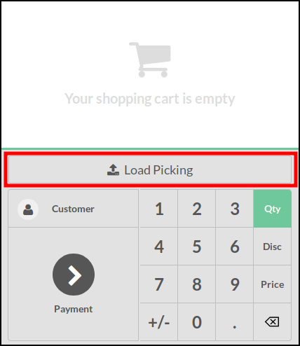
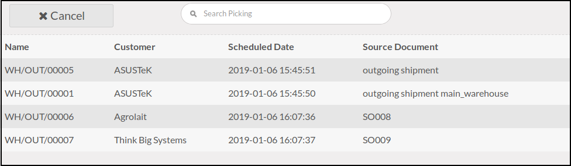
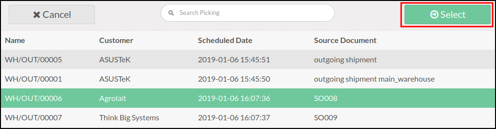
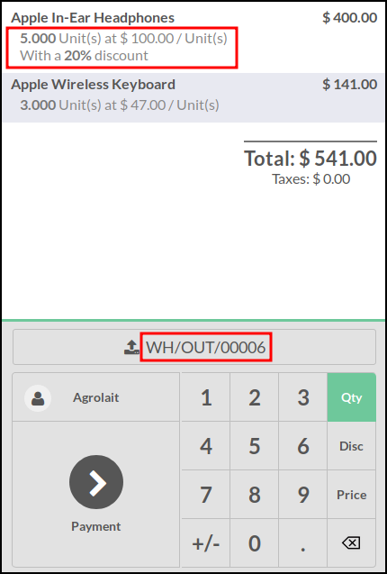
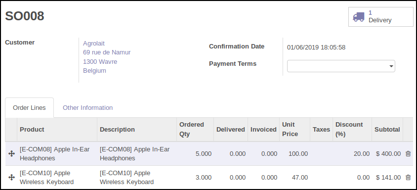
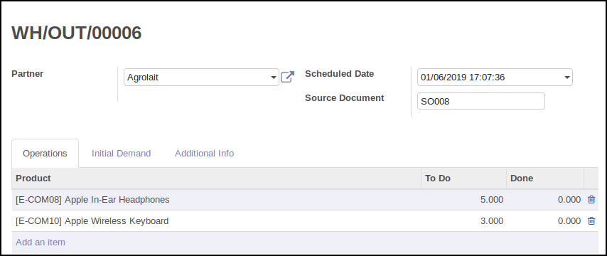
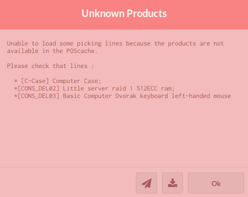
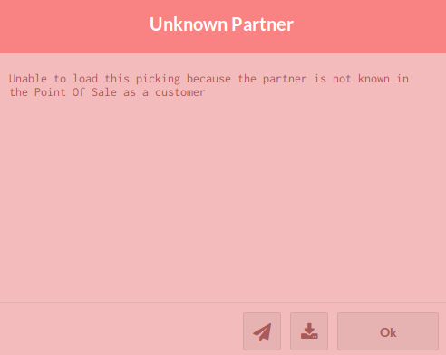
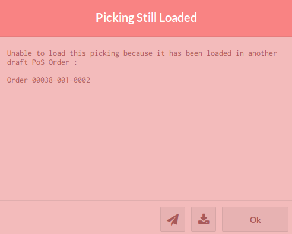

To use this module, you need to:

* Launch the point of sale
* On a new order (without lines), click on the 'Load Picking' button.

* Point of sale will load available pickings. (About displayed pickings, see
  'Technical Notes' section).

* Click on a picking will check if the picking is loadable and if yes, will
  display a 'Select' button. (See 'Possible Warnings' Section)

* Confirm the selection, by clicking on 'Select' button. It will display
  the content of the moves (as PoS Order Lines)

The price and the discount will be the sale price and the discount set in
the according Sale Order Line, if it was found. Otherwise, discount will be
set to 0, and unit price will be the unit price of the product when it has been
loaded in the Point of Sale.

**Related Sale Order:**

**Related Picking:**

* Finally, you can add / remove products or change quantity and collect the
  payment.

When, the order is marked as paid, the original picking will be cancelled,
because Point Of Sale generates a new picking related to the real delivered
products and the original Sale Order will pass to the state 'Done'. (Delivery
exception is ignored).
(See 'Technical Notes' section).

**Possible Warnings**

Some warning messages can appear:

* if some products are not available in the Point of Sale

* if the partner is not available in the Point of Sale

* if the picking has been still loaded in another PoS order

