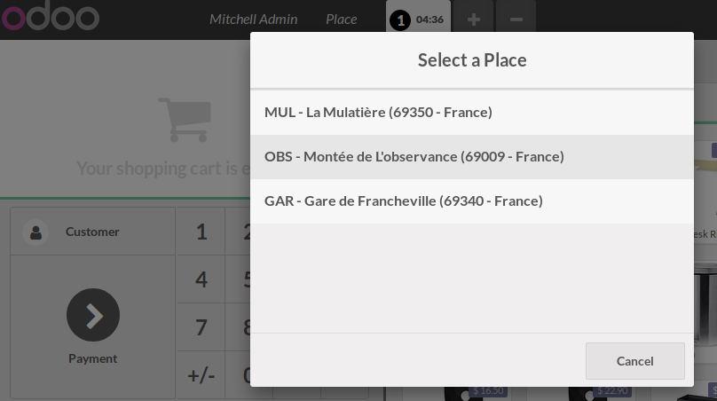
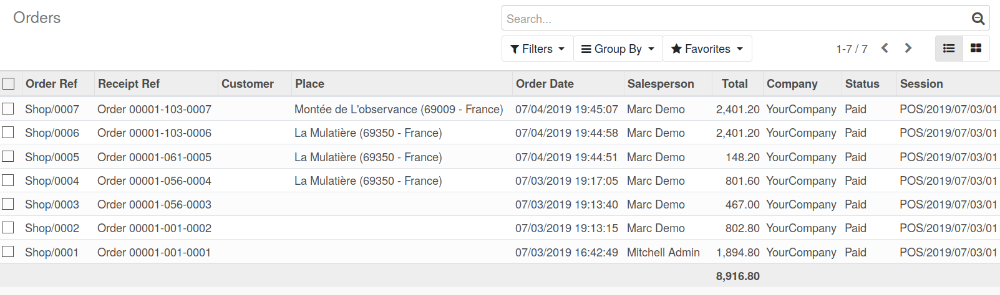
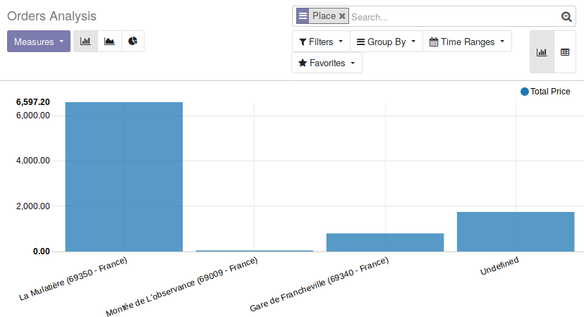

To use this module, you need to

* open the point of sale

* Click on 'Place' Button and select the place where you are

* All the next Pos Order will be related to this place.

* You can then, make statistic over best places

