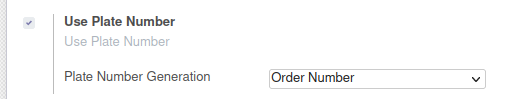

To configure this module, you need to:

* Go to 'Point Of Sale' / 'Configuration' / 'Point of Sale' and edit your
  PoS Config, setting if you want to use a plate number and how it would be generated.

