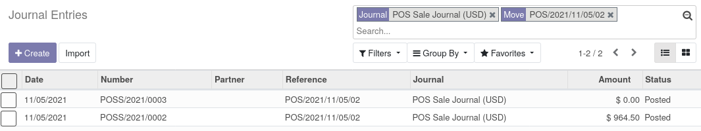

This module extends Odoo Point Of Sale features, to prevent user
to double close sessions.

This can happen if the user clicks twice on the "close session" button in two different windows.

In this case, Odoo will generate two sales entries, one of which will have a zero amount.
Deleting it will create a hole in the sales entries numbering.

This module prevent such cases.
