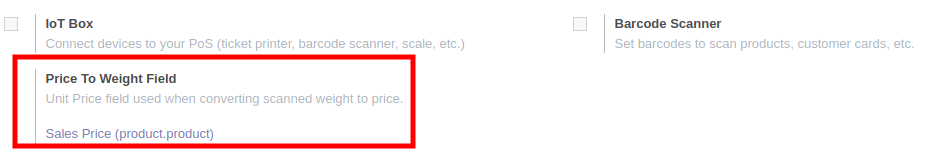

* Go to Point of Sale > Configuration > Barcode Nomenclatures
* Edit your barcode rules, according to your barcodes settings

* Go to Point of Sale > Configuration > Point of Sale
* Select the 'Unit Price' field that will be used to convert the price to weight.

**Note:**

By default, this is the field ``list_price`` that will be used.
If you want to use a custom field, it should be loaded in the javascript file calling

``models.load_fields("product.product", ['my_custom_field']);``
