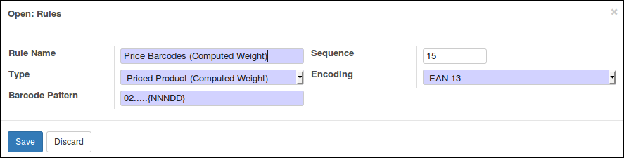
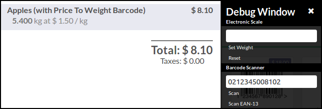

This module extends Odoo Point Of Sale features, to allow to scan barcode
with price and to compute according quantity.

In Odoo by default, there are three types of barcode rules for products.

* 'Unit Product' (type='product'). Scanning a product will add a unit of this
  product to the current order.
* 'Priced product' (type='price'). A price is extracted from the barcode, and
  a new line with the given price and a quantity = 1 is added to the current
  order.
* 'Weighted product' (type='weight). A weight is extracted from the barcode,
  and a new line with the given weight, and a computed price
  (quantity * Unit price) is added to the current order.

This module add a new option:

* 'Priced Product (Computed Weight)' (type='price_to_weight'). A price is
  extracted from the barcode, and a new line with the given price, and a
  computed quantity (Price / Unit Price) is added to the current order.

This module is usefull in shops with products scaled, to manage correctly
stock quantities.

Samples

* Given a product with a unit price of 1,50€ / kg
* The barcode is 0212345{NNNDD}x where:
    * 02 is the prefix of the barcode rule
    * 12345 is the product number
    * {NNNDD} is the price of the scaled product
    * x is the control digit

if {NNNDD} is 00265, the price is so 2,65€ and the according quantity is
2,65€ / 1,5 €/kg = 1,767 kg

if {NNNDD} is 00810, the price is so 8,10€ and the according quantity is
8,10€ / 1,5 €/kg = 5,400 kg

